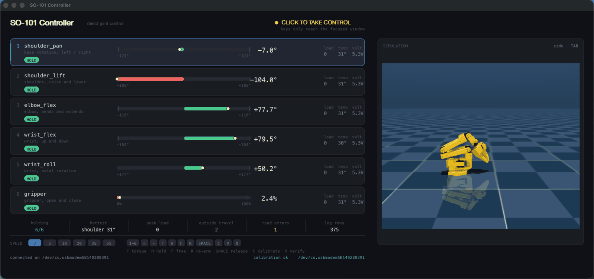
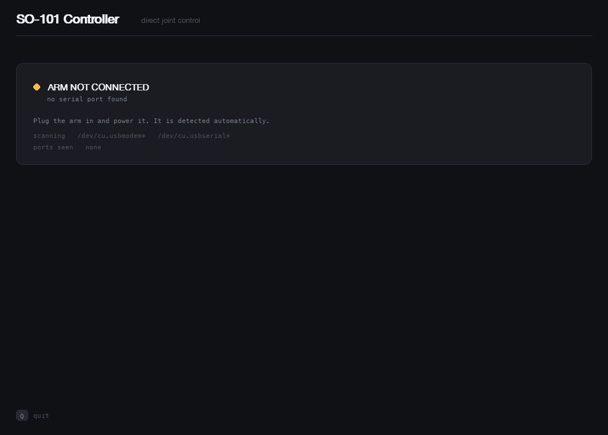
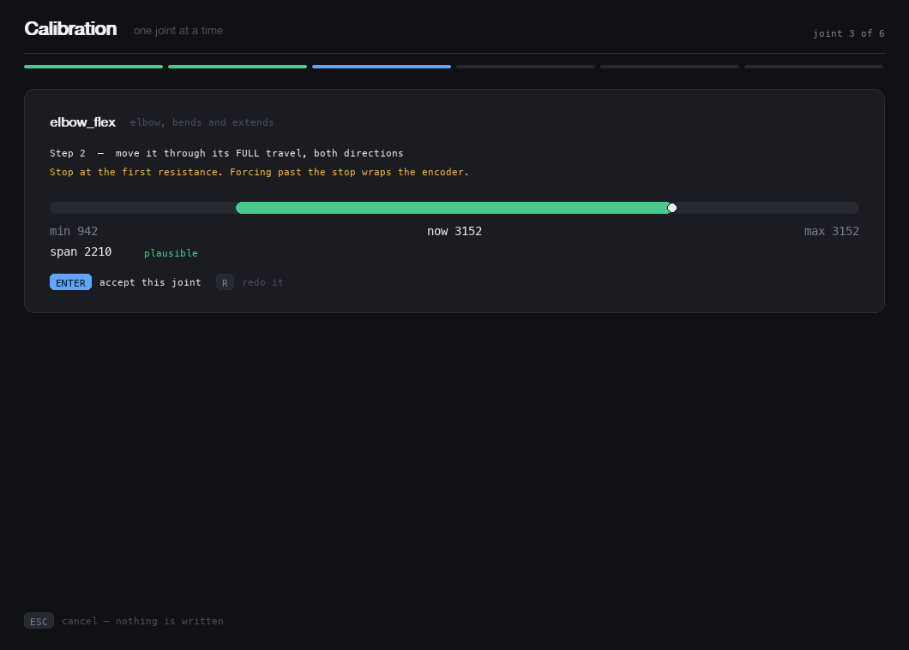
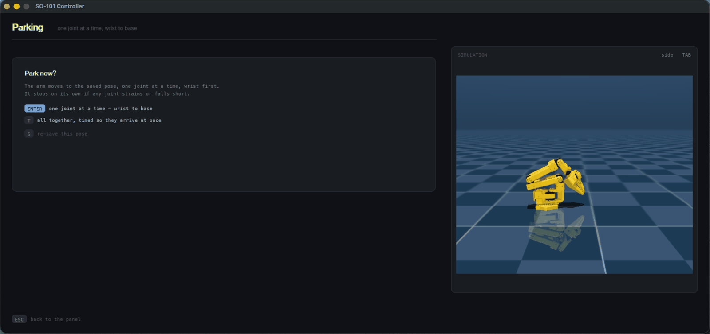

# so101-panel

A control panel for the [SO-101](https://github.com/TheRobotStudio/SO-ARM100) robot arm.
Drive one joint at a time, watch load and temperature live, and calibrate the arm
through a guided procedure instead of a terminal prompt.

Built on [LeRobot](https://github.com/huggingface/lerobot). No leader arm required —
the keyboard is the teleoperator.



## Why

Three things go wrong repeatedly with an SO-101, and all three are fixed here.

**You unplug the arm, move it by hand, and the calibration is gone.** The homing offsets
live in each motor's EEPROM. Turning a joint while the arm is unpowered rehomes it
wherever it happens to sit, so the motors and the calibration file no longer agree.
Power the arm up in that state and it snaps to a position it was never at. The panel
checks the motors against the file *before* it enables torque, and offers to write the
file back.

**Calibration is all-or-nothing.** `lerobot-calibrate` records every joint in one pass.
Push a single joint past its mechanical stop and the encoder wraps: `8..4093` looks like
a legitimate full-turn range to the recorder, the resulting scale is wrong, and the only
way out is to redo everything. This panel calibrates one joint at a time, judges each
recorded span before keeping it, and lets you redo just that joint.

**The serial port is a constant you edit by hand.** Plug the arm into a different USB
port and every script needs the new path. Here it is detected, and remembered.

## Requirements

- Python 3.12 or newer (required by `lerobot`)
- An SO-101 follower arm with Feetech STS3215 servos
- macOS or Linux (developed and tested on macOS; the serial patterns cover both)
- `mujoco` for the 3D view — optional, and installed by `requirements.txt`

## Install

```bash
git clone https://github.com/BenMousaAmine/so101-panel.git
cd so101-panel
python -m venv .venv && source .venv/bin/activate
pip install -r requirements.txt
```

## Run

```bash
python teleop/controller.py
```

The panel opens whether or not the arm is plugged in. Connect it and power it, and the
panel finds it within a second.



### First time: calibrate

A new arm has no calibration on your machine, so the panel offers the guided procedure.
Press **C**.



Every joint is limp throughout. For each one you centre it by hand, then move it through
its full travel while the panel records the span live. **Stop at the first resistance** —
forcing past the mechanical stop is what wraps the encoder.

Each span is judged before it is kept:

| Verdict | Meaning |
|---|---|
| `plausible` | The span matches a healthy joint. |
| `unusual span` | Outside the usual range. Keep it if the movement felt right. |
| `wrapped past the stop` | The encoder rolled over. Redo the joint. |
| `barely moved` | Under 200 counts. Move it through its whole travel. |

Nothing is written until all six joints pass and you confirm. Press **ESC** at any point
and the existing calibration is untouched.

### If the arm was moved while unplugged

The panel catches this on connection and offers to fix it. From inside the panel, **V**
runs the same check on demand: it compares each motor's homing offset against the file
and, if they disagree, drops torque and writes the file back to the motors.

### Controls

| Key | Action |
|---|---|
| `1`–`6` | Select a joint |
| `←` `→` | Drive the selected joint while held |
| `↑` `↓` | Speed |
| `T` | Toggle torque on the selected joint |
| `H` | Hold every joint where it is |
| `F` | Free every joint — **support the arm first** |
| `R` | Re-arm after a stop |
| `C` | Guided calibration |
| `V` | Verify the motors against the calibration file, and restore it if they drifted |
| `SPACE` (hold 1s) | Release all torque — **the arm will drop** |
| `P` | Park the arm in its saved safe pose |
| `TAB` | Change the 3D camera — side, front, top |
| `Q` / `ESC` | Quit — offers to park first, when a safe pose is saved |

There is no inverse kinematics: a joint can never be asked for a position it cannot
reach. Each bar is drawn against that joint's calibrated range, filled from its rest
point, with ticks where the software stops driving.

The panel refuses to keep straining a stuck joint. Past a load threshold it blocks the
direction that is straining and tells you to drive the other way — resetting the target
instead makes the motor fight itself at 30 Hz.

### The 3D view

The column on the right is the arm itself, not an animation of it: the real joint
positions are written into a MuJoCo model every frame, so it shows where the arm actually
is — including where it sagged, stalled, or was pushed by hand. `TAB` cycles the camera.

```bash
python teleop/controller.py --sim      # no hardware at all: the model *is* the arm
python teleop/controller.py --no-3d    # the panel alone
```

Under `--sim` the model is driven by physics instead of by the arm, so it falls when
torque is cut and sags under its own weight — useful for trying a sequence out before
running it on hardware. It is not a substitute for the real thing: the simulated servos
saturate at their rated torque, and a parking pose the arm reaches every day can stall
in simulation.

If `mujoco` is not installed the panel drops the column and runs exactly as before.

### Parking

`P` moves the arm to a pose you saved earlier, and `Q` offers the same thing on the way
out. Joints go one at a time, wrist to base, so the arm only ever passes through poses
that order was chosen for — `T` moves them together instead, timed to arrive at once.
A joint that strains or falls short stops the whole run rather than forcing it.

Press `S` on the parking screen to save wherever the arm is standing now as that pose.
It is written to `teleop/safe_pose.json`, which is git-ignored: a pose measured on one
arm, in that arm's calibration, is not a safe pose on another.



## If a joint will not move

A joint can start up beyond its calibrated travel, if the arm sagged past a limit while
it was unpowered. It shows as `outside travel`; drive it back inside — the limit never
blocks the direction that returns it.

A joint that reads a very high load is straining against something: an obstacle, its own
mechanical stop, or a pose the arm cannot hold. The panel blocks the direction that is
straining and asks you to drive the other way, or free that joint with `T`.

## Safety

The arm has no brakes. With torque off it falls under its own weight.

- `F`, `SPACE` and the calibration all cut torque. Support the arm before using them.
- After a restore or a calibration the arm is left limp on purpose. The panel waits for
  you to take its weight before arming, because powering up locks it exactly where it
  is — if it has sagged, that is the pose it will hold.
- Quitting releases torque. The arm drops if nothing is holding it.
- Restoring a calibration changes the position each motor believes it is at, so it is
  always done with torque off.
- **The panel writes to the motors' EEPROM.** On every connection it sets
  `P_Coefficient` to 36 on all six joints, and that setting is permanent: it survives
  closing the panel, and other lerobot scripts will find it. `lerobot`'s own
  `configure()` writes 16, at which the loop stops pushing long before the available
  torque is used — measured on this arm, `shoulder_lift` climbed 2.9° at P=16 against
  36.7° at P=36. To go back to the stock value, run `lerobot`'s setup, or write 16
  yourself. The constant lives in `teleop/limits.py` as `POSITION_P`.

## Other tools

```bash
python teleop/check_calibration.py       # judge a calibration file before trusting it
python teleop/restore_calibration.py     # write the file back to the motors
```

`check_calibration.py` compares each joint's span against the travel of a healthy
SO-101. Those bounds were measured by hand on one arm: a warning means *look at this*,
not *this is broken*.

## Multiple arms

The calibration is filed under a robot id, `so101` by default:

```bash
SO101_ID=left_arm python teleop/controller.py
```

## Logs

Every session is written to `data/logs/` as CSV, one row per frame with the position,
load, temperature and voltage of all six joints. Useful for working out what a motor was
doing before it stalled.

## Credits

The MuJoCo model in `assets/SO101/` comes from the
[SO-ARM100](https://github.com/TheRobotStudio/SO-ARM100) project, generated from the
Onshape CAD with [onshape-to-robot](https://github.com/Rhoban/onshape-to-robot). The
meshes and joint definitions are theirs; only the panel around them is mine.

## Licence

Apache 2.0 — see [LICENSE](LICENSE).
